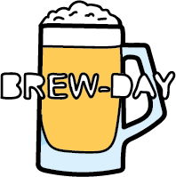

# BREWDAY!

Brew Day! è un’applicazione fornita in cloud secondo il modello SAAS (Software as a service) che permette ad ogni “beer enthusiasts“ di gestire la propria produzione di birra artigianale.

L’applicazione permette in modo semplice ed intuitivo ad ogni utente registrato di salvare, organizzare e tenere traccia delle proprie ricette, degli ingredienti utilizzati e della loro disponibilità nella propria dispensa e degli strumenti che ha a disposizione per produrre la propria birra.

# Procedura di installazione (SAAS e On-premises)

Per come si sta evolvendo il mondo dell’informatica e dell’ormai onnipresenza di software forniti come servizi, abbiamo deciso di implementare il nostro progetto secondo questa filosofia SAAS.

La maniera più semplice e intuitiva quindi per poter fruire della nostra applicazione è quella di sfruttare la sua versione in cloud e accederci tramite l’url: https://brewday.progetto-is.com che porta direttamente alla nostra infrastruttura di produzione su AWS; è anche il modo principale con cui ci aspettiamo che i nostri ipotetici clienti utlizzeranno la nostra applicazione.

A scopo di test o di sviluppo è possibile eseguire in locale l’applicazione o parte di essa seguendo queste istruzioni:
 

## Docker Compose

### Requisiti:

- Docker

- docker-compose

Dalla root del progetto eseguire il comando 
`docker-compose up`

Il comando si occuperà di scaricare le immagini da docker hub e manderà in esecuzione tutto l’ambiente.

Il frontend sarà accessibile sulla porta 4200 tramite browser

Il database inzialmente sarà vuoto quindi la prima operazione da fare sarà quella di eseguire la registrazione dal frontend.

 

## Effettuare il build delle immagini docker direttamente dai sorgenti (opzionale):

### Requisiti: 

- Docker

- Maven

### Backend:

Dalla root del progetto

`cd backend`

`mvn clean install` (Aggiungre `-DskipTests=true` per saltare i test unitari)

`docker build -f Dockerfile-compose -t gruppobirra2/brewday:local .`

 

### Maximizebrew:

Dalla root del progetto

`cd maximizebrewtoday`

`docker build -t gruppobirra2/maximizebrewtoday:local .`

 

### Frontend:

Dalla root del progetto

`cd frontend`

`docker build -t gruppobirra2/brewday-frontend:local .`
